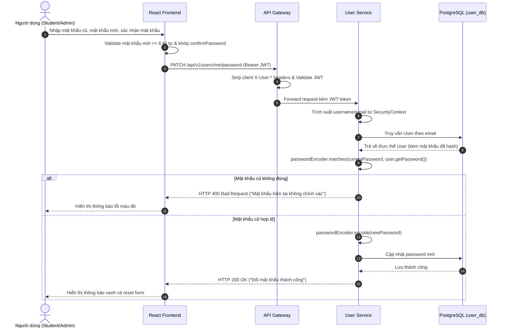

# TÀI LIỆU PHÂN TÍCH HỆ THỐNG (02-ANALYSIS)

> **Mô hình quy trình:** Thác Nước (Waterfall Lifecycle) - Pha 2: Phân Tích Hệ Thống (System Analysis)  
> **Dự án:** English LMS - Hệ thống quản lý học tập tiếng Anh trực tuyến  
> **Phiên bản:** 1.2 • Ngày: 17/09/2026

---

## 1. PHÂN TÍCH TÁC NHÂN HỆ THỐNG (ACTORS)

1. **Khách vãng lai (Guest):**
   - Người dùng chưa đăng nhập, chỉ có quyền xem danh mục khóa học, xem tóm tắt bài học và đăng ký/đăng nhập tài khoản.
2. **Học viên (Student - `ROLE_STUDENT`):**
   - Xem và cập nhật hồ sơ cá nhân, tự đổi mật khẩu.
   - Ghi danh khóa học miễn phí, học thử 5 bài đầu miễn phí của khóa học trả phí.
   - Thanh toán mua toàn bộ khóa học qua cổng thanh toán (VNPay / Mock Gateway).
   - Tương tác với Trợ lý AI (Chat, Ngữ pháp, Trắc nghiệm) và quản lý lịch sử AI của chính mình.
   - Đánh dấu hoàn thành bài học và theo dõi tiến độ cá nhân.
3. **Quản trị viên (Admin - `ROLE_ADMIN`):**
   - Toàn quyền quản lý tài khoản người dùng (Thêm, Khóa/Mở khóa, Đổi mật khẩu, Xóa).
   - Quản lý danh mục khóa học và bài học (Thêm, Sửa, Xóa, Sắp xếp thứ tự bài học).
   - Theo dõi báo cáo doanh thu bán khóa học, quản lý danh sách đơn hàng.
   - Giám sát tiến độ học tập và xem thống kê tổng hợp toàn hệ thống (FR-21).

---

## 2. PHÂN TÍCH CÁC LUỒNG NGHIỆP VỤ CỐT LÕI (CORE BUSINESS WORKFLOWS)

### 2.1. Luồng Đổi mật khẩu tự phục vụ (FR-06)

### 2.2. Luồng Học thử 5 bài đầu và Mở khóa Khóa học Trả phí (FR-07, FR-19)
1. **Khóa học miễn phí (`isFree = true`):** Học viên đăng ký sẽ nhận trạng thái `ACTIVE`, được phép truy cập 100% các bài học.
2. **Khóa học trả phí (`price > 0`):**
   - Học viên bắt đầu học với trạng thái ghi danh `TRIAL`.
   - Bài học 1 đến 5 (`lessonOrder` từ 0 đến 4): Học viên được phép xem nội dung chi tiết và video bài giảng.
   - Bài học từ thứ 6 trở đi (`lessonOrder >= 5`): Hệ thống kiểm tra trạng thái ghi danh. Nếu chưa thanh toán (`status != ACTIVE`), backend trả về lỗi HTTP 403 Forbidden kèm mã lỗi `COURSE_PURCHASE_REQUIRED`.
   - Giao diện `LessonView.jsx` bắt mã lỗi này và hiển thị Hộp thoại Yêu cầu Thanh toán kèm nút chuyển hướng đến trang Checkout.

### 2.3. Luồng Xử lý Callback Thanh toán Bất biến (Idempotent Payment Callback)
- Khi cổng thanh toán (VNPay / Mock) gửi thông báo IPN hoặc Callback về `POST /api/v1/payments/vnpay/callback`:
  - Hệ thống kiểm tra mã đơn hàng `orderId`.
  - Nếu đơn hàng đã ở trạng thái `PAID`, hệ thống ghi nhận log và trả về HTTP 200 ngay lập tức, không thực hiện cập nhật lại doanh thu hay tạo thêm bản ghi enrollment.
  - Nếu đơn hàng đang `PENDING`: Cập nhật trạng thái thành `PAID`, chuyển trạng thái ghi danh của học viên thành `ACTIVE` và mở khóa toàn bộ bài học.

---

## 3. PHÂN TÍCH QUY TẮC AN TOÀN & BẢO MẬT (SECURITY & PRIVACY RULES)

1. **Ngăn chặn Giả mạo Header (Anti-Header Spoofing):**
   - Khách hàng không được phép tự truyền các header `X-User-Role`, `X-User-Email`, `X-User-Id`.
   - API Gateway thực hiện xóa (strip) toàn bộ các header này trước khi xử lý hoặc chuyển tiếp request.
   - Các dịch vụ downstream tự động trích xuất định danh và quyền hạn trực tiếp từ Bearer JWT đã được ký hợp lệ.
2. **Quyền riêng tư Dữ liệu AI (AI Session & History Privacy):**
   - Mỗi câu truy vấn AI và phản hồi được gắn với `userEmail` của người gửi.
   - Khi học viên truy vấn lịch sử qua `GET /api/v1/ai/history`, API buộc phải áp dụng điều kiện `WHERE user_email = :currentEmail`. Không hỗ trợ fallback `findAll()` cho học viên.
3. **Phòng chống Tấn công Prompt Injection:**
   - Dữ liệu người dùng nhập vào được bọc tách biệt trong prompt gửi đến LLM.
   - System Instructions của AI Service đặt các nguyên tắc an toàn ưu tiên cao nhất: từ chối các câu lệnh yêu cầu hủy bỏ chỉ dẫn ban đầu ("Ignore previous instructions"), từ chối sinh mã độc hoặc tiết lộ cấu hình hệ thống.
