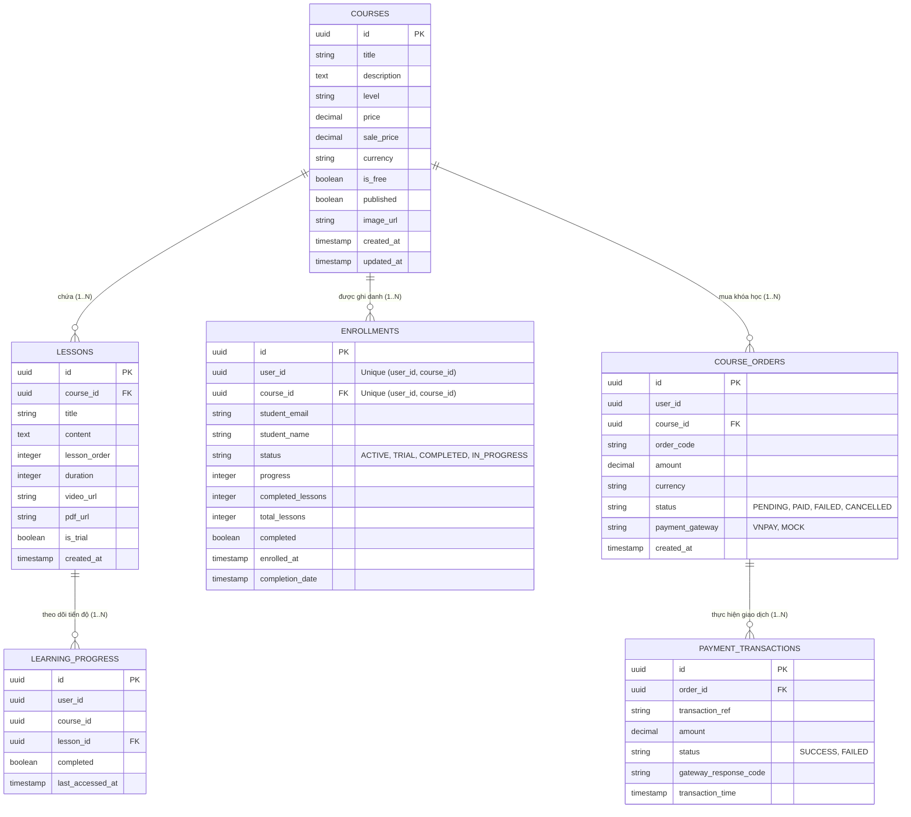
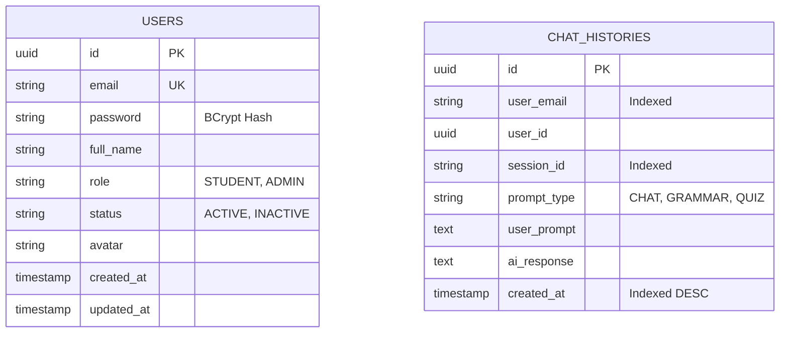

# THIẾT KẾ CƠ SỞ DỮ LIỆU (03-DATABASE-DESIGN)

> **Mô hình quy trình:** Thác Nước (Waterfall Lifecycle) - Pha 2 & 6: Thiết Kế & Quản Trị CSDL  
> **Dự án:** English LMS - Hệ thống quản lý học tập tiếng Anh trực tuyến  
> **Cơ sở dữ liệu:** PostgreSQL 16 • Quản lý phiên bản: Flyway Migrations (`V1..V14`)  
> **Phiên bản tài liệu:** 1.2 • Ngày: 17/09/2026

---

## 1. MÔ HÌNH DATABASE-PER-SERVICE
Để đảm bảo tính độc lập, khả năng mở rộng (NFR-07) và an toàn dữ liệu, English LMS phân chia ranh giới lưu trữ thành 3 cơ sở dữ liệu vật lý riêng biệt:

1. **`user_db` (User Service):** Lưu trữ thông tin tài khoản người dùng, mật khẩu đã mã hóa BCrypt, thông tin hồ sơ và vai trò người dùng (`STUDENT`, `ADMIN`).
2. **`course_db` (Course Service):** Lưu trữ thông tin khóa học, bài học, lượt ghi danh (enrollments), tiến độ hoàn thành bài học, đơn hàng và giao dịch thanh toán.
3. **`ai_db` (AI Service):** Lưu trữ lịch sử tương tác AI (Chat, Grammar Check, Quiz Generation) và quản lý phiên hội thoại (sessions).

---

## 2. SƠ ĐỒ THỰC THỂ LIÊN KẾT (ERD MERMAID DIAGRAM)

### 2.1. CSDL `course_db`


### 2.2. CSDL `user_db` & `ai_db`


---

## 3. DANH SÁCH RÀNG BUỘC TOÀN VẸN & CHỈ MỤC HIỆU NĂNG (INDEXES & CONSTRAINTS)

### 3.1. Ràng buộc toàn vẹn (Integrity Constraints)
- **`uq_enrollments_user_course` (Flyway Migration V14):**
  ```sql
  ALTER TABLE enrollments ADD CONSTRAINT uq_enrollments_user_course UNIQUE (user_id, course_id);
  ```
  *Mục đích:* Ngăn chặn tuyệt đối việc một học viên bị tạo 2 bản ghi ghi danh trên cùng một khóa học khi gặp tình trạng gửi request đồng thời (Race Condition).
- **`uk_users_email`:**
  ```sql
  ALTER TABLE users ADD CONSTRAINT uk_users_email UNIQUE (email);
  ```
  *Mục đích:* Đảm bảo tính duy nhất của tài khoản định danh theo địa chỉ email.

### 3.2. Chỉ mục tối ưu hóa truy vấn (Performance Indexes - NFR-03)
- `idx_enrollments_user_course`: B-Tree index trên `(user_id, course_id)` phục vụ kiểm tra quyền học nhanh chóng.
- `idx_enrollments_email_course`: B-Tree index trên `(student_email, course_id)` phục vụ truy vấn ghi danh của học viên.
- `idx_learning_progress_user_course_lesson`: B-Tree index trên `(user_id, course_id, lesson_id)` phục vụ kiểm tra trạng thái hoàn thành bài học.
- `idx_chat_histories_user_session`: B-Tree index trên `(user_email, session_id, created_at DESC)` phục vụ trích xuất ngữ cảnh hội thoại AI.

---

## 4. CHÍNH SÁCH MIGRATION & JPA SCHEMA VALIDATION
1. **Flyway là nguồn sự thật duy nhất (Single Source of Truth):**
   - Mọi thay đổi schema đều phải tạo file migration mới với định dạng `V{version}__{description}.sql`.
   - Tuyệt đối không chỉnh sửa hoặc xóa các file migration cũ đã từng chạy ở bất kỳ môi trường nào.
2. **JPA ddl-auto Policy:**
   - Trong môi trường Docker Compose và Production: `spring.jpa.hibernate.ddl-auto = validate`.
   - Không sử dụng `ddl-auto = update` để tránh Hibernate tự ý sinh alter table làm sai lệch cấu trúc CSDL được kiểm soát bởi Flyway.
