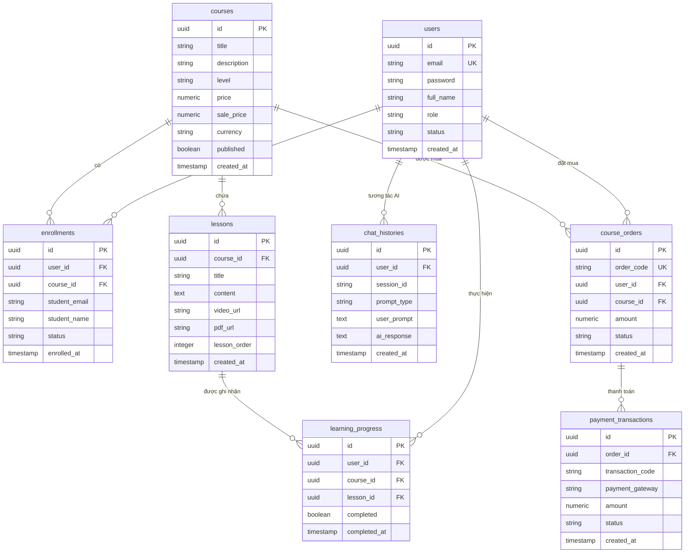

# TÀI LIỆU CƠ SỞ DỮ LIỆU & MIGRATION (03-DATABASE)

---

## 1. SƠ ĐỒ THỰC THỂ NGUYÊN THỂ (MERMAID ERD DIAGRAM)

---

## 2. DANH SÁCH BẢNG CƠ SỞ DỮ LIỆU THEO MICROSERVICES

### 2.1. Database `user_db` (User Service)
- **Bảng `users`**:
  - `id` (UUID, Primary Key)
  - `email` (VARCHAR 255, Unique Key, Not Null)
  - `password` (VARCHAR 255, BCrypt Hashed)
  - `full_name` (VARCHAR 255)
  - `role` (VARCHAR 50, Giá trị: `ROLE_STUDENT`, `ROLE_ADMIN`)
  - `status` (VARCHAR 50, Giá trị: `ACTIVE`, `SUSPENDED`)
  - `created_at` (TIMESTAMP)

### 2.2. Database `course_db` (Course Service)
- **Bảng `courses`**:
  - `id` (UUID, Primary Key)
  - `title` (VARCHAR 255, Not Null)
  - `description` (TEXT)
  - `level` (VARCHAR 50, Chuẩn hóa: `BEGINNER`, `INTERMEDIATE`, `ADVANCED`)
  - `price` (DECIMAL 12,2, Mặc định `0.00`)
  - `sale_price` (DECIMAL 12,2)
  - `currency` (VARCHAR 10, Mặc định `VND`)
  - `published` (BOOLEAN, Mặc định `true`)

- **Bảng `lessons`**:
  - `id` (UUID, Primary Key)
  - `course_id` (UUID, Foreign Key tham chiếu `courses.id`)
  - `title` (VARCHAR 255, Not Null)
  - `content` (TEXT, Nội dung bài học Markdown)
  - `video_url` (VARCHAR 500, Link YouTube Embed)
  - `pdf_url` (VARCHAR 500, Link tài liệu PDF)
  - `document_url` (VARCHAR 500)
  - `lesson_order` (INTEGER, Thứ tự bài học 1, 2, 3...)

- **Bảng `enrollments`**:
  - `id` (UUID, Primary Key)
  - `user_id` (UUID, Foreign Key)
  - `course_id` (UUID, Foreign Key)
  - `student_email` (VARCHAR 255)
  - `student_name` (VARCHAR 255)
  - `status` (VARCHAR 50, Giá trị: `TRIAL`, `ACTIVE`, `LEGACY_FREE`, `EXPIRED`, `CANCELLED`)
  - **Index Hiệu năng (Migration V13)**:
    - `idx_enrollments_user_course` `(user_id, course_id)`
    - `idx_enrollments_email_course` `(student_email, course_id)`
    - `idx_enrollments_status` `(status)`

- **Bảng `course_orders`**:
  - `id` (UUID, Primary Key)
  - `order_code` (VARCHAR 100, Unique Key)
  - `user_id` (UUID, Foreign Key)
  - `course_id` (UUID, Foreign Key)
  - `amount` (DECIMAL 12,2)
  - `status` (VARCHAR 50, Giá trị: `PENDING`, `PAID`, `CANCELLED`, `EXPIRED`)

- **Bảng `payment_transactions`**:
  - `id` (UUID, Primary Key)
  - `order_id` (UUID, Foreign Key tham chiếu `course_orders.id`)
  - `transaction_code` (VARCHAR 100)
  - `payment_gateway` (VARCHAR 50, Giá trị: `VNPAY`, `MOCK`)
  - `amount` (DECIMAL 12,2)
  - `status` (VARCHAR 50, Giá trị: `SUCCESS`, `FAILED`)

- **Bảng `learning_progress`**:
  - `id` (UUID, Primary Key)
  - `user_id` (UUID, Foreign Key)
  - `course_id` (UUID, Foreign Key)
  - `lesson_id` (UUID, Foreign Key)
  - `completed` (BOOLEAN, Mặc định `true`)
  - **Index Hiệu năng (Migration V13)**:
    - `idx_learning_progress_user_course_lesson` `(user_id, course_id, lesson_id)`
    - `idx_learning_progress_completed` `(completed)`

### 2.3. Database `ai_db` (AI Service)
- **Bảng `chat_histories`**:
  - `id` (UUID, Primary Key)
  - `user_id` (UUID, Foreign Key)
  - `session_id` (VARCHAR 100, Mã phiên hội thoại)
  - `prompt_type` (VARCHAR 50, Giá trị: `CHAT`, `GRAMMAR`, `QUIZ`)
  - `user_prompt` (TEXT)
  - `ai_response` (TEXT)
  - `created_at` (TIMESTAMP)
  - **Index Hiệu năng (Migration V2)**:
    - `idx_chat_histories_user_session` `(user_id, session_id)`
    - `idx_chat_histories_lookup` `(user_id, session_id, prompt_type, created_at)`

---

## 3. QUY TẮC MIGRATION (FLYWAY MIGRATION POLICY)

- **Quy tắc Append-Only**: Tuyệt đối **KHÔNG** chỉnh sửa các file Migration đã thực thi trong lịch sử (`V1__...` đến `V10__...`).
- Tất cả các nâng cấp cấu trúc Database, chuẩn hóa dữ liệu hoặc bổ sung Index đều phải tạo file Migration mới có thứ tự tăng dần (Ví dụ: `V11__add_course_pricing_orders_payments.sql`, `V12__normalize_course_levels_and_media.sql`, `V13__add_performance_indexes.sql`).
