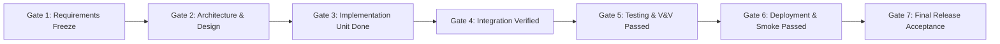

# CÁC CỔNG GIAI ĐOẠN PHÁT TRIỂN (WATERFALL STAGE GATES)
**Dự án:** English LMS – Hệ thống Quản lý Khóa học Tiếng Anh Trực tuyến Tích hợp AI  
**Tiêu chuẩn áp dụng:** ISO/IEC/IEEE 12207:2017 & IEEE 730-2014  
**Mô hình phát triển:** Thác nước Tuyến tính (Strict Linear Waterfall)  
**Phiên bản:** 1.2 • **Ngày cập nhật:** 17/09/2026  

---

## 1. NGUYÊN TẮC QUẢN LÝ CỔNG GIAI ĐOẠN (STAGE GATE PRINCIPLES)

1. **Tính tuần tự (Linear Precedence):** Một giai đoạn chỉ được bắt đầu khi cổng giai đoạn (Stage Gate) của giai đoạn liền trước đã được đóng và nghiệm thu chính thức với đầy đủ bằng chứng kỹ thuật (Technical Evidence).
2. **Không nghiệm thu giả lập (Zero Fake Evidence):** Không phê duyệt vượt cổng dựa trên các báo cáo phỏng đoán hoặc dữ liệu mock che giấu lỗi.
3. **Đóng băng thay đổi (Change Freeze):** Sau khi một cổng giai đoạn được đóng (ví dụ: Gate 1 - Requirements Freeze), mọi thay đổi phát sinh phải qua quy trình Quản lý Yêu cầu Thay đổi (Change Request - CR) với phân tích tác động đầy đủ (Impact Analysis).

---

## 2. ĐỊNH NGHĨA 7 CỔNG GIAI ĐOẠN (STAGE GATES 1 - 7)

---

### STAGE GATE 1: ĐÓNG BĂNG YÊU CẦU (REQUIREMENTS FREEZE)
- **Giai đoạn tương ứng:** Pha 1 – Khảo sát, Thu thập & Phân tích Yêu cầu (Requirements Engineering).
- **Mục tiêu:** Chốt chặn toàn bộ phạm vi 21 chức năng (FR-01 đến FR-21) và 10 nhóm phi chức năng (NFR-01 đến NFR-10).
- **Tiêu chí đầu vào (Entry Criteria):**
  - Tài liệu đặc tả yêu cầu người dùng ban đầu.
  - Mã nguồn hiện trạng được kiểm kê đầy đủ.
- **Tiêu chí đầu ra / Điều kiện đóng cổng (Exit Criteria):**
  - [x] Baseline yêu cầu hoàn chỉnh với định danh duy nhất (FR-01..21, NFR-01..10) và tiêu chí nghiệm thu rõ ràng.
  - [x] FR-21 có định nghĩa số liệu cụ thể (Users, Courses, Lessons, Enrollments, Doanh thu).
  - [x] Báo cáo kiểm toán hiện trạng (`docs/01-baseline-audit.md`) hoàn thành.
  - [x] Khung ma trận truy vết (`docs/TRACEABILITY_MATRIX.md`) được thiết lập.
- **Sản phẩm bàn giao (Deliverables):** `docs/REQUIREMENTS_BASELINE.md`, `docs/01-baseline-audit.md`, `docs/TRACEABILITY_MATRIX.md`.

---

### STAGE GATE 2: PHÊ DUYỆT KIẾN TRÚC VÀ THIẾT KẾ (ARCHITECTURE & DESIGN REVIEW)
- **Giai đoạn tương ứng:** Pha 2 – Phân tích Kiến trúc & Thiết kế Chi tiết (System & Software Design).
- **Mục tiêu:** Thiết lập cấu trúc Microservices, lược đồ dữ liệu và hợp đồng giao tiếp chuẩn xác.
- **Tiêu chí đầu ra / Điều kiện đóng cổng (Exit Criteria):**
  - [x] Tài liệu phân tích Use Cases và sơ đồ tuần tự chi tiết (`docs/02-analysis.md`).
  - [x] Kiến trúc Microservices loại bỏ các thành phần chưa triển khai (Kafka, Redis), cập nhật vai trò Vercel và GitHub CI/CD (`docs/02-architecture.md`).
  - [x] Thiết kế Database-per-Service, ràng buộc `UNIQUE(user_id, course_id)`, chỉ mục và chính sách Flyway migration (`docs/03-database-design.md`).
  - [x] Hợp đồng REST API chuẩn hóa, phản ánh đúng các endpoint backend thực tế (`docs/04-api.md`).
  - [x] Kế hoạch bảo đảm chất lượng theo IEEE 730 và ISO/IEC 25010 (`docs/06-quality-plan.md`).
- **Sản phẩm bàn giao (Deliverables):** `docs/02-analysis.md`, `docs/02-architecture.md`, `docs/03-database-design.md`, `docs/04-api.md`, `docs/06-quality-plan.md`.

---

### STAGE GATE 3: HOÀN TẤT LẬP TRÌNH & KIỂM THỬ ĐƠN VỊ (IMPLEMENTATION & UNIT VERIFIED)
- **Giai đoạn tương ứng:** Pha 3 – Lập trình & Kiểm thử Đơn vị (Implementation & Unit Testing).
- **Mục tiêu:** Cài đặt toàn bộ mã nguồn chức năng, sửa lỗi gốc, đảm bảo kiểm thử đơn vị thành công.
- **Tiêu chí đầu ra / Điều kiện đóng cổng (Exit Criteria):**
  - [x] FR-06 Đổi mật khẩu tự phục vụ cài đặt hoàn chỉnh: API BCrypt backend, UI Profile frontend và Unit Tests.
  - [x] Loại bỏ N+1 query tại `CourseServiceImpl.getAllEnrollmentsForAdmin` bằng truy vấn gom nhóm theo batch.
  - [x] Flyway migration `V14__add_unique_constraint_enrollments.sql` bổ sung ràng buộc toàn vẹn cơ sở dữ liệu.
  - [x] AI Prompt Injection Guardrails được cài đặt trong các Strategy Prompt.
  - [x] Loại bỏ hoàn toàn mock fallback dữ liệu giả (`sampleCourses`) tại Frontend.
  - [x] Tất cả Unit Test backend chạy thành công (100% PASS).
  - [x] Frontend chạy `npm run build` thành công không phát sinh lỗi cú pháp hay thiếu phụ thuộc.
- **Sản phẩm bàn giao (Deliverables):** Source code backend/frontend, Flyway migration V14, Unit Test Reports.

---

### STAGE GATE 4: TÍCH HỢP HỆ THỐNG VÀ KIỂM SOÁT BẢO MẬT (INTEGRATION & SECURITY VERIFIED)
- **Giai đoạn tương ứng:** Pha 4 – Tích hợp Hệ thống & Thẩm tra An toàn (System Integration & Security Audit).
- **Mục tiêu:** Tích hợp các service qua API Gateway, chặn đứng lỗ hổng bảo mật và giả mạo quyền hạn.
- **Tiêu chí đầu ra / Điều kiện đóng cổng (Exit Criteria):**
  - [x] Chống Header Spoofing: Downstream service độc lập xác thực JWT Bearer, không tin cậy header tự xưng từ client.
  - [x] RBAC nghiêm ngặt: Các endpoint `/api/v1/admin/**` chặn đứng quyền Student (HTTP 403).
  - [x] Cách ly dữ liệu AI: Lịch sử tương tác AI chỉ hiển thị dữ liệu thuộc quyền sở hữu của chính học viên.
  - [x] Frontend tích hợp Axios Interceptor: Xử lý 401 (xóa token, chuyển hướng đăng nhập) và chống double-click khi gửi form.
  - [x] Kịch bản kiểm thử bảo mật tự động xác nhận hệ thống an toàn.
- **Sản phẩm bàn giao (Deliverables):** `scripts/smoke-test.ps1`, Báo cáo kết quả kiểm thử an toàn.

---

### STAGE GATE 5: KIỂM THỬ CHẤP NHẬN & HIỆU NĂNG (VERIFICATION & VALIDATION PASSED)
- **Giai đoạn tương ứng:** Pha 5 – Kiểm thử Hệ thống & Đo lường Hiệu năng (System Testing & Performance Verification).
- **Mục tiêu:** Xác minh 100% kịch bản kiểm thử, đo lường tải thực tế bằng JMeter và kiểm tra tương thích thiết bị.
- **Tiêu chí đầu ra / Điều kiện đóng cổng (Exit Criteria):**
  - [x] Bộ Test Cases bao phủ đầy đủ 21 FR và 10 NFR (`docs/test-cases.md`).
  - [x] Kịch bản Apache JMeter (`performance/english-lms-performance.jmx`) sẵn sàng và đo lường thời gian phản hồi API nghiệp vụ < 2.0 giây.
  - [x] Xác minh tương thích giao diện Responsive trên 3 kích thước: 375x667 (Mobile), 768x1024 (Tablet), 1366x768 (Desktop).
  - [x] Báo cáo kiểm thử chi tiết và Nhật ký lỗi (`docs/TEST_RESULTS.md`) được cập nhật với kết quả thực tế.
  - [x] Không còn lỗi Blocker hoặc Critical mở.
- **Sản phẩm bàn giao (Deliverables):** `docs/09-testing.md`, `docs/test-cases.md`, `docs/TEST_RESULTS.md`, `performance/english-lms-performance.jmx`.

---

### STAGE GATE 6: CONTAINER HÓA & TRIỂN KHAI VẬN HÀNH (DEPLOYMENT & SMOKE TEST PASSED)
- **Giai đoạn tương ứng:** Pha 6 – Đóng gói Triển khai & Kiểm thử Khởi động (Deployment & Smoke Verification).
- **Mục tiêu:** Hệ thống có khả năng triển khai độc lập, tự động hóa qua Docker Compose và Vercel.
- **Tiêu chí đầu ra / Điều kiện đóng cổng (Exit Criteria):**
  - [x] Dockerfile multi-stage build cho các service backend có khả năng build trên máy sạch mà không phụ thuộc file jar trên host.
  - [x] Script tự động sao lưu (`scripts/backup-db.ps1`) và phục hồi cơ sở dữ liệu (`scripts/restore-db.ps1`) kèm tài liệu hướng dẫn (`docs/backup-restore.md`).
  - [x] Cấu hình triển khai Frontend Vercel (`frontend/vercel.json`) hỗ trợ rewrite SPA tránh lỗi 404 khi truy cập deep-link.
  - [x] Thiết lập quy trình CI/CD GitHub Actions (`frontend-ci.yml`, `backend-ci.yml`, `security.yml`).
  - [x] Kịch bản Smoke Test (`scripts/smoke-test.ps1`) kiểm tra Gateway và các service phản hồi HTTP 200 OK.
- **Sản phẩm bàn giao (Deliverables):** `docs/10-deployment.md`, `docs/VERCEL_DEPLOYMENT.md`, `scripts/backup-db.ps1`, `scripts/restore-db.ps1`, `scripts/smoke-test.ps1`.

---

### STAGE GATE 7: NGHIỆM THU PHÁT HÀNH CUỐI CÙNG (FINAL RELEASE ACCEPTANCE)
- **Giai đoạn tương ứng:** Pha 7 – Bàn giao, Nghiệm thu & Chuyển giao Bảo trì (Final Acceptance & Handover).
- **Mục tiêu:** Đóng toàn bộ dự án, ký biên bản nghiệm thu kỹ thuật và phát hành phiên bản 1.2.
- **Tiêu chí đầu ra / Điều kiện đóng cổng (Exit Criteria):**
  - [x] Tất cả các tiêu chí của Stage Gates 1 đến 6 đều đã đạt trạng thái PASSED.
  - [x] Không còn bất kỳ secret thực tế nào trong mã nguồn hoặc lịch sử commit được đề xuất.
  - [x] Toàn bộ tài liệu Waterfall đồng bộ hoàn toàn với mã nguồn thực tế.
  - [x] Bản ghi chú phát hành (`RELEASE_NOTES.md`) và Nhật ký thay đổi (`CHANGELOG.md`) được cập nhật đầy đủ.
  - [x] Báo cáo nghiệm thu kỹ thuật cuối cùng (`docs/FINAL_ACCEPTANCE.md`) được phê duyệt.
- **Sản phẩm bàn giao (Deliverables):** `docs/FINAL_ACCEPTANCE.md`, `RELEASE_NOTES.md`, `CHANGELOG.md`, `README.md`.
