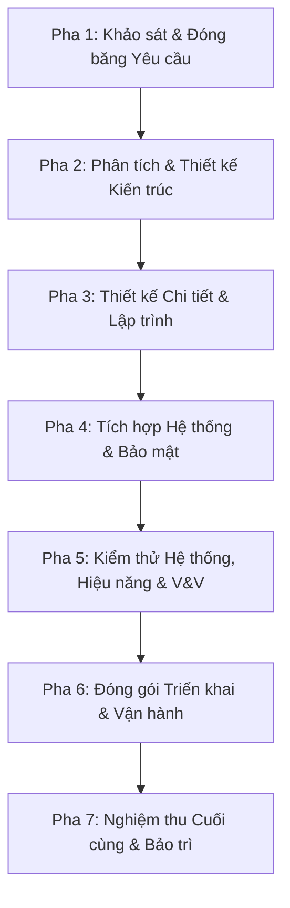

# KẾ HOẠCH PHÁT TRIỂN HỆ THỐNG THEO MÔ HÌNH THÁC NƯỚC (WATERFALL DEVELOPMENT PLAN)
**Dự án:** English LMS – Hệ thống Quản lý Khóa học Tiếng Anh Trực tuyến Tích hợp AI  
**Tiêu chuẩn áp dụng:** ISO/IEC/IEEE 12207:2017 Systems and software engineering – Software life cycle processes  
**Mô hình phát triển:** Thác nước Tuyến tính (Strict Linear Waterfall Lifecycle)  
**Phiên bản:** 1.2 • **Ngày cập nhật:** 17/09/2026  

---

## 1. TỔNG QUAN QUY TRÌNH VÀ NGUYÊN TẮC CHUYỂN ĐỔI (TRANSITION OVERVIEW)

### 1.1. Chuyển đổi từ mô hình Agile/Sprint sang Waterfall
Dự án English LMS trước đây ghi nhận quá trình phát triển thông qua các chu kỳ lặp (Sprint 1 đến Sprint 6). Nhằm đáp ứng mục tiêu đồ án kỹ thuật phần mềm, đảm bảo tính chặt chẽ trong quản lý tài liệu, kiểm toán chất lượng và nghiệm thu sản phẩm, toàn bộ quy trình phát triển và kiểm soát chất lượng của dự án được chuyển dịch hoàn toàn sang **Mô hình Thác nước Tuyến tính (Strict Linear Waterfall)**.

> [!IMPORTANT]
> Lịch sử thực hiện trong quá khứ chỉ mang tính chất tham khảo tiến trình. Toàn bộ hồ sơ kỹ thuật hiện tại và tương lai được phân bổ theo chuỗi pha Waterfall tuần tự. Một giai đoạn sau chỉ được thực thi khi toàn bộ tiêu chí đóng cổng (Stage Gate) của giai đoạn trước đã được xác nhận với đầy đủ bằng chứng (Evidence-driven).

---

## 2. CHUỖI CÁC PHA TUYẾN TÍNH TRONG VÒNG ĐỜI PHÁT TRIỂN (PHASE BREAKDOWN)

---

### PHA 1: KHẢO SÁT VÀ ĐÓNG BĂNG YÊU CẦU (REQUIREMENTS ENGINEERING)
- **Mục tiêu:** Kiểm toán hiện trạng hệ thống, xác lập danh mục yêu cầu chuẩn hóa gồm 21 chức năng nghiệp vụ (FR-01 đến FR-21) và 10 nhóm phi chức năng (NFR-01 đến NFR-10).
- **Hoạt động thực hiện:**
  1. Kiểm toán toàn diện source code backend, frontend, database, cấu hình Docker và kiểm thử.
  2. Bãi bỏ các giả định "DONE" không có căn cứ từ báo cáo cũ; thiết lập hiện trạng thật.
  3. Định nghĩa cụ thể các chỉ số đo lường cho FR-21 (Thống kê hệ thống).
  4. Xây dựng Ma trận Truy vết Yêu cầu ban đầu (Traceability Matrix).
- **Hồ sơ đầu ra:** `docs/01-baseline-audit.md`, `docs/REQUIREMENTS_BASELINE.md`, `docs/TRACEABILITY_MATRIX.md`.
- **Cổng nghiệm thu:** **Stage Gate 1 – Requirements Freeze**.

---

### PHA 2: PHÂN TÍCH VÀ THIẾT KẾ KIẾN TRÚC (SYSTEM ANALYSIS & ARCHITECTURE DESIGN)
- **Mục tiêu:** Phân tích ca sử dụng (Use Cases), thiết kế kiến trúc phân tán microservices, mô hình dữ liệu per-service và hợp đồng giao tiếp RESTful.
- **Hoạt động thực hiện:**
  1. Xây dựng tài liệu phân tích chi tiết: luồng nghiệp vụ chính, kịch bản ngoại lệ, sơ đồ tuần tự (Sequence Diagrams).
  2. Cập nhật kiến trúc Microservices thực tế: loại bỏ các công nghệ chưa triển khai (Kafka, Redis, RAG), xác lập mô hình phân tách frontend (Vercel) và backend (Docker/VPS).
  3. Thiết kế cơ sở dữ liệu: lược đồ ERD, chỉ mục hiệu năng (indexes), ràng buộc toàn vẹn `UNIQUE(user_id, course_id)` và chính sách di chuyển dữ liệu Flyway.
  4. Chuẩn hóa danh mục REST API endpoints khớp hoàn toàn với Controller backend.
  5. Lập Kế hoạch Đảm bảo Chất lượng (Quality Plan) theo IEEE 730 và ISO/IEC 25010.
- **Hồ sơ đầu ra:** `docs/02-analysis.md`, `docs/02-architecture.md`, `docs/03-database-design.md`, `docs/04-api.md`, `docs/06-quality-plan.md`, `docs/07-waterfall-gates.md`.
- **Cổng nghiệm thu:** **Stage Gate 2 – Architecture & Design Review**.

---

### PHA 3: THIẾT KẾ CHI TIẾT VÀ LẬP TRÌNH CHỨC NĂNG (DETAILED DESIGN & IMPLEMENTATION)
- **Mục tiêu:** Hiện thực hóa mã nguồn các chức năng còn thiếu, khắc phục triệt để các lỗi logic, tối ưu hóa truy vấn cơ sở dữ liệu và xây dựng kiểm thử đơn vị (Unit Tests).
- **Hoạt động thực hiện:**
  1. **FR-06 Đổi mật khẩu:** Cài đặt endpoint `PATCH /api/v1/users/me/password`, kiểm tra mật khẩu hiện tại bằng BCrypt, ngăn tái sử dụng mật khẩu cũ, tích hợp form đổi mật khẩu trên giao diện người dùng kèm chống double-click.
  2. **Tối ưu hóa N+1:** Khắc phục vòng lặp truy vấn tại `CourseServiceImpl.getAllEnrollmentsForAdmin` bằng cách bổ sung truy vấn tổng hợp theo nhóm (`countLessonsGroupByCourseId` và `countCompletedGroupByUserIdAndCourseId`).
  3. **Ràng buộc Database:** Tạo migration Flyway `V14__add_unique_constraint_enrollments.sql` bổ sung ràng buộc toàn vẹn `UNIQUE (user_id, course_id)`.
  4. **Bảo vệ AI:** Cài đặt chỉ thị hệ thống chống Prompt Injection cho `ChatPromptStrategy`, `GrammarPromptStrategy`, `QuizPromptStrategy`; giới hạn số câu hỏi quiz từ 5 đến 10 câu.
  5. **Loại bỏ dữ liệu giả:** Xóa bỏ hoàn toàn mảng dữ liệu mẫu `sampleCourses` trên frontend; hiển thị thông báo lỗi và nút thử lại khi kết nối API thất bại.
- **Hồ sơ đầu ra:** Mã nguồn cập nhật, Flyway Migration V14, Báo cáo Unit Test.
- **Cổng nghiệm thu:** **Stage Gate 3 – Implementation Unit Done**.

---

### PHA 4: TÍCH HỢP HỆ THỐNG VÀ KIỂM SOÁT BẢO MẬT (INTEGRATION & SECURITY VERIFICATION)
- **Mục tiêu:** Tích hợp các dịch vụ qua API Gateway, thiết lập cơ chế bảo vệ chiều sâu (Defense-in-Depth), kiểm soát quyền truy cập và bảo vệ dữ liệu riêng tư.
- **Hoạt động thực hiện:**
  1. Loại bỏ rủi ro giả mạo thông tin định danh (Header Spoofing): Gateway loại bỏ các header `X-User-*` do người dùng tự gửi; các dịch vụ downstream độc lập xác thực JWT Bearer token.
  2. Áp dụng `@EnableMethodSecurity` và `@PreAuthorize("hasRole('ADMIN')")` bảo vệ các API quản trị.
  3. Đảm bảo tính riêng tư dữ liệu (NFR-06): Lịch sử hội thoại AI và tiến độ học tập chỉ truy cập được bởi chính chủ sở hữu.
  4. Đồng bộ hóa phiên đăng nhập: Xử lý phản hồi HTTP 401 tại Axios Interceptor, xóa token hết hạn và chuyển hướng người dùng về trang đăng nhập một cách mượt mà.
- **Hồ sơ đầu ra:** `scripts/smoke-test.ps1`, Báo cáo kiểm thử bảo mật.
- **Cổng nghiệm thu:** **Stage Gate 4 – Integration & Security Verified**.

---

### PHA 5: KIỂM THỬ HỆ THỐNG, HIỆU NĂNG VÀ ĐẢM BẢO CHẤT LƯỢNG (TESTING, JMETER & V&V)
- **Mục tiêu:** Xác minh toàn bộ các ca kiểm thử theo chuẩn ISO/IEC/IEEE 29119, đo lường hiệu năng tải với Apache JMeter và kiểm tra tương thích giao diện.
- **Hoạt động thực hiện:**
  1. Xây dựng Kế hoạch kiểm thử chi tiết (`docs/09-testing.md`) và Danh mục ca kiểm thử (`docs/test-cases.md`) bao phủ đầy đủ 21 FR và 10 NFR.
  2. Thiết kế và thực thi kịch bản đo lường hiệu năng Apache JMeter (`performance/english-lms-performance.jmx`): kiểm tra Catalog, Auth, Admin Stats và AI Service.
  3. Kiểm tra hiển thị responsive trên 3 kích thước chuẩn: 375x667 (Mobile), 768x1024 (Tablet), 1366x768 (Desktop).
  4. Tổng hợp Nhật ký lỗi (Defect Log) và Báo cáo kết quả kiểm thử thực tế (`docs/TEST_RESULTS.md`).
- **Hồ sơ đầu ra:** `docs/09-testing.md`, `docs/test-cases.md`, `docs/TEST_RESULTS.md`, `docs/RESPONSIVE_VERIFICATION.md`.
- **Cổng nghiệm thu:** **Stage Gate 5 – Verification & Validation Passed**.

---

### PHA 6: ĐÓNG GÓI TRIỂN KHAI VÀ TỰ ĐỘNG HÓA VẬN HÀNH (DEPLOYMENT & CI/CD)
- **Mục tiêu:** Chuẩn hóa quy trình đóng gói container Docker Compose, cấu hình tự động hóa CI/CD GitHub Actions và triển khai Frontend lên Vercel.
- **Hoạt động thực hiện:**
  1. Cấu hình Dockerfile multi-stage build cho toàn bộ dịch vụ backend, cho phép build thành công trên môi trường sạch.
  2. Phát triển script sao lưu (`scripts/backup-db.ps1`) và phục hồi cơ sở dữ liệu (`scripts/restore-db.ps1`) kèm quy trình xác minh trên môi trường sandbox.
  3. Thiết lập cấu hình Vercel (`frontend/vercel.json`) hỗ trợ rewrite SPA, tài liệu hóa hướng dẫn triển khai (`docs/VERCEL_DEPLOYMENT.md`) và checklist smoke test (`docs/VERCEL_SMOKE_TEST.md`).
  4. Cấu hình GitHub Actions Workflows: `frontend-ci.yml`, `backend-ci.yml`, `security.yml` và quy trình bảo vệ nhánh `main`.
- **Hồ sơ đầu ra:** `docs/10-deployment.md`, `docs/VERCEL_DEPLOYMENT.md`, `docs/GITHUB_CI_CD.md`, `docs/backup-restore.md`.
- **Cổng nghiệm thu:** **Stage Gate 6 – Deployment & Smoke Passed**.

---

### PHA 7: NGHIỆM THU PHÁT HÀNH CUỐI CÙNG VÀ BẢO TRÌ (FINAL ACCEPTANCE & MAINTENANCE)
- **Mục tiêu:** Hoàn tất toàn bộ hồ sơ nghiệm thu kỹ thuật, rà soát an toàn bí mật (Secret Hygiene), xuất bản phiên bản phát hành chính thức 1.2.
- **Hoạt động thực hiện:**
  1. Rà soát lần cuối toàn bộ mã nguồn, đảm bảo không có API keys, JWT secrets hoặc passwords dạng văn bản thuần.
  2. Lập Báo cáo Nghiệm thu Kỹ thuật Cuối cùng (`docs/FINAL_ACCEPTANCE.md`).
  3. Cập nhật `README.md`, `RELEASE_NOTES.md` và `CHANGELOG.md`.
  4. Xác lập quy trình bảo trì, giám sát lỗi vận hành và quy trình khắc phục sự cố khẩn cấp (Hotfix Flow).
- **Hồ sơ đầu ra:** `docs/FINAL_ACCEPTANCE.md`, `RELEASE_NOTES.md`, `CHANGELOG.md`, `README.md`.
- **Cổng nghiệm thu:** **Stage Gate 7 – Final Release Acceptance**.
