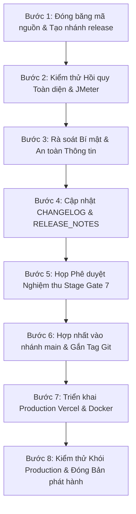

# QUY TRÌNH PHÁT HÀNH PHIÊN BẢN (WATERFALL RELEASE PROCESS)
**Dự án:** English LMS – Hệ thống Quản lý Khóa học Tiếng Anh Trực tuyến Tích hợp AI  
**Mô hình quy trình:** Thác nước Tuyến tính (Strict Linear Waterfall Release Gates)  
**Phiên bản phát hành:** 1.2 • **Ngày ban hành:** 17/09/2026  

---

## 1. NGUYÊN TẮC VÀ ĐIỀU KIỆN PHÁT HÀNH (RELEASE PRINCIPLES)

1. **Tuân thủ Cổng giai đoạn (Stage Gate Enforced):** Một bản phát hành chính thức chỉ được xuất xưởng khi toàn bộ 7 cổng giai đoạn từ Gate 1 đến Gate 7 đã được ký duyệt nghiệm thu với đầy đủ bằng chứng kiểm thử thực tế.
2. **Đóng băng phạm vi (Scope Freeze):** Tuyệt đối không thêm bất kỳ tính năng nghiệp vụ mới nào trong giai đoạn đóng gói và chuẩn bị phát hành.
3. **Đánh dấu phiên bản chuẩn Semantic Versioning (SemVer):** Phiên bản được định dạng theo cấu trúc `MAJOR.MINOR.PATCH` (Ví dụ: `v1.2.0`).

---

## 2. QUY TRÌNH 8 BƯỚC PHÁT HÀNH CHUẨN (8-STEP RELEASE WORKFLOW)



### Bước 1: Đóng băng mã nguồn và tạo nhánh phát hành
- Sau khi hoàn thành các ca kiểm thử tích hợp (Gate 4), tạo nhánh phát hành từ mã nguồn đã kiểm toán:
  ```bash
  git checkout -b release/v1.2.0
  ```
- Thông báo cho toàn đội ngũ phát triển về trạng thái đóng băng mã nguồn (Code Freeze).

### Bước 2: Kiểm thử hồi quy toàn diện và đo tải hiệu năng
- Chạy toàn bộ bộ kiểm thử tự động backend: `mvn clean test` cho toàn bộ các dịch vụ.
- Chạy kiểm thử đóng gói frontend: `npm run build`.
- Thực thi kịch bản đo lường hiệu năng Apache JMeter (`performance/english-lms-performance.jmx`) với 20 concurrent threads để kiểm tra độ trễ p95 < 2.0s.

### Bước 3: Rà soát bí mật và an toàn thông tin (Secret Scan & Sanitization)
- Rà soát toàn diện mã nguồn: Đảm bảo không có chuỗi khóa bí mật, JWT Secret, PostgreSQL password hay Google Gemini API key dạng văn bản thuần.
- Kiểm tra file `.env.example` và tài liệu hướng dẫn chỉ sử dụng các chuỗi giữ chỗ (Placeholders).

### Bước 4: Cập nhật hồ sơ phát hành
- Cập nhật nhật ký thay đổi [CHANGELOG.md](file:///c:/Users/ASUS/BTL_MSCNPTPM/english-lms/CHANGELOG.md).
- Soạn thảo bản ghi chú phát hành chi tiết [RELEASE_NOTES.md](file:///c:/Users/ASUS/BTL_MSCNPTPM/english-lms/RELEASE_NOTES.md) gồm: Các tính năng mới (FR-06, Vercel SPA rewrite), các lỗi đã khắc phục (N+1 query, enrollment unique constraint, loại bỏ mock `sampleCourses`).

### Bước 5: Họp phê duyệt nghiệm thu Stage Gate 7
- Hội đồng nghiệm thu (Tech Lead, QA Lead, Product Owner) xem xét tài liệu [docs/FINAL_ACCEPTANCE.md](file:///c:/Users/ASUS/BTL_MSCNPTPM/english-lms/docs/FINAL_ACCEPTANCE.md).
- Ký duyệt đóng cổng giai đoạn Stage Gate 7.

### Bước 6: Hợp nhất vào nhánh `main` và gắn thẻ phiên bản (Git Tag)
- Mở Pull Request từ `release/v1.2.0` vào `main`.
- Sau khi toàn bộ các status checks trên GitHub Actions đạt trạng thái PASS, tiến hành Merge.
- Tạo thẻ phiên bản (Git Tag) có chữ ký số hoặc chú thích rõ ràng:
  ```bash
  git checkout main
  git pull origin main
  git tag -a v1.2.0 -m "Release English LMS Version 1.2.0 - Waterfall Lifecycle"
  git push origin v1.2.0
  ```

### Bước 7: Kích hoạt triển khai Production
- **Frontend:** Vercel tự động kích hoạt Production Deployment khi nhận commit mới trên nhánh `main`.
- **Backend:** Thực hiện triển khai trên cụm máy chủ Docker Compose theo quy trình tại [docs/10-deployment.md](file:///c:/Users/ASUS/BTL_MSCNPTPM/english-lms/docs/10-deployment.md).

### Bước 8: Kiểm thử khói trên môi trường Production (Production Smoke Test)
- Thực hiện kiểm tra nhanh theo bảng kiểm tại [docs/VERCEL_SMOKE_TEST.md](file:///c:/Users/ASUS/BTL_MSCNPTPM/english-lms/docs/VERCEL_SMOKE_TEST.md) và kịch bản `scripts/smoke-test.ps1`.
- Xác nhận các luồng: Đăng nhập, đổi mật khẩu (FR-06), xem khóa học, ghi danh, tương tác AI, thống kê quản trị (FR-21).
- Nếu phát sinh lỗi nghiêm trọng, lập tức kích hoạt quy trình thu hồi bản phát hành [docs/ROLLBACK.md](file:///c:/Users/ASUS/BTL_MSCNPTPM/english-lms/docs/ROLLBACK.md).
