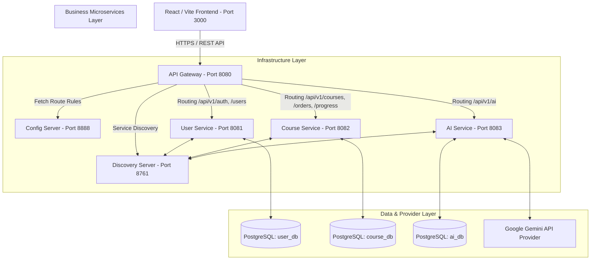
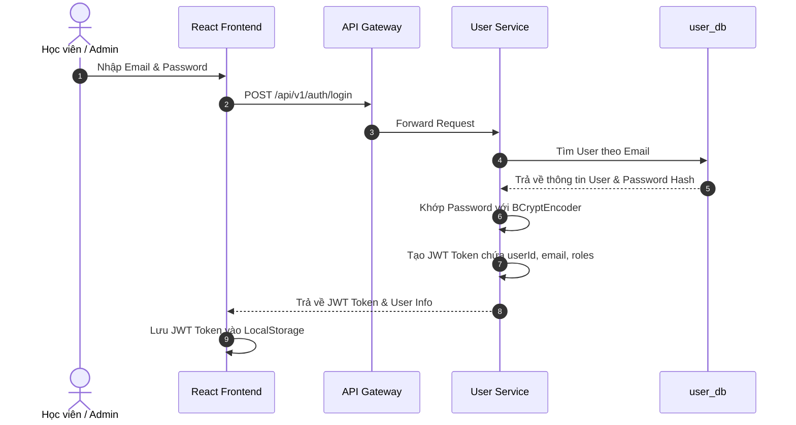
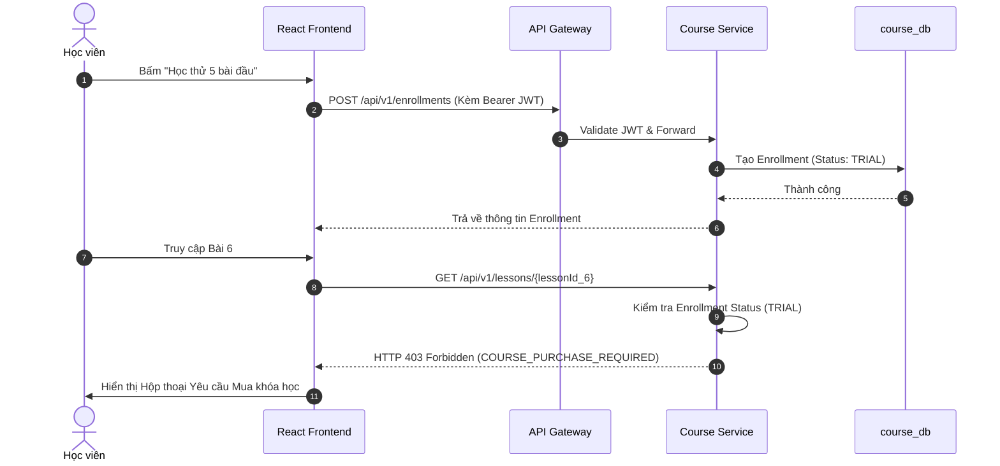
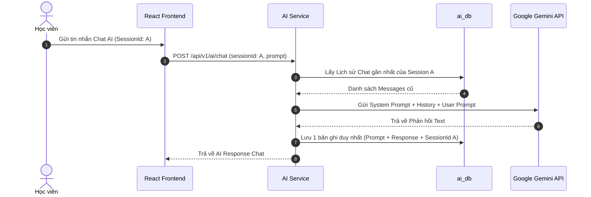

# TÀI LIỆU KIẾN TRÚC HỆ THỐNG (02-ARCHITECTURE)

---

## 1. SƠ ĐỒ TỔNG QUAN KIẾN TRÚC (MERMAID SYSTEM DIAGRAM)

---

## 2. THÀNH PHẦN HẠ TẦNG VÀ PHÂN VÙNG BẢO MẬT (TRUST BOUNDARY)

### 2.1. Discovery Server (Eureka Server - Port 8761)
Đóng vai trò Service Registry, tự động quản lý IP và trạng thái sức khỏe (Health Check) của tất cả microservices trong hệ thống. Đảm bảo API Gateway thực hiện cân bằng tải (Load Balancing `lb://`) linh hoạt.

### 2.2. Config Server (Port 8888)
Lưu trữ và phân phối cấu hình tập trung cho toàn bộ hệ thống từ thư mục cấu hình. Hỗ trợ thay đổi tham số môi trường động mà không cần Rebuild mã nguồn.

### 2.3. API Gateway (Port 8080) & Ranh giới Tin cậy (Trust Boundary)
- **Kiểm tra JWT tại Gateway**: Gateway kiểm tra định dạng Token và giải mã Signature đầu tiên đối với các request vào endpoint bảo mật.
- **Tại sao các Microservice bên trong vẫn phải Validate JWT?**: Theo nguyên tắc Zero-Trust Security, API Gateway chỉ đóng vai trò rào chắn ngoài. Các microservices (`user-service`, `course-service`, `ai-service`) vẫn phải độc lập trích xuất JWT Token, kiểm tra quyền hạn (`ROLE_STUDENT` / `ROLE_ADMIN`) và lấy `userId` chính xác từ JWT Claims nhằm ngăn chặn hành vi mạo danh thông tin giữa các service (Header Spoofing).

---

## 3. CÁC LUỒNG XỬ LÝ CHÍNH (SEQUENCE FLOWS)

### 3.1. Luồng Đăng nhập & Xác thực JWT (Login & Authentication Flow)

### 3.2. Luồng Đăng ký & Học thử Bài học (Trial & Enrollment Flow)

### 3.3. Luồng Chat AI Duy trì Session (AI Chat Session Flow)

